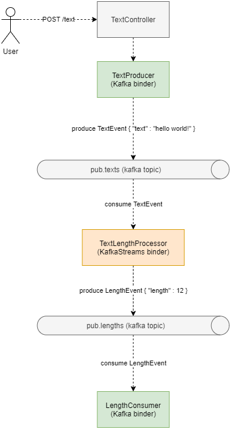

[](https://github.com/rogervinas/spring-cloud-stream-multibinder/actions/workflows/gradle.yml)

# Spring Cloud Stream Multibinder

[Spring Cloud Stream](https://spring.io/projects/spring-cloud-stream) is the solution provided by **Spring** to build applications connected to shared messaging systems.

It offers an abstraction (the **binding**) that works the same whatever underneath implementation we use (the **binder**):
* **Apache Kafka**
* **Rabbit MQ**
* **Kafka Streams**
* **Amazon Kinesis**
* ...

But what if we need more than one binder in the same application? 🤔

Not a problem! You can specify multiple binder configurations as documented in [Connecting to Multiple Systems](https://cloud.spring.io/spring-cloud-stream/spring-cloud-stream.html#multiple-systems)

Let's put the theory into practice 🛠️ ...

## Goal

We want to implement this flow:



* User will POST string payloads to **/text** endpoint
* A **KafkaProducer** will send these payloads to topic **pub.texts** as `{ "text" : string }`
* A **KafkaStreams** transformation will consume from topic **pub.texts** and produce events to topic **pub.lengths** as `{ "length" : number }`
* A **KafkaConsumer** will consume events from topic **pub.lengths** and log them to the console

So we will use two Spring Cloud Stream binders:
* **Kafka**
* **Kafka Streams**

## Create the project

We use this [spring initializr configuration](https://start.spring.io/#!type=gradle-project&language=kotlin&platformVersion=2.5.4&packaging=jar&jvmVersion=11&groupId=com.rogervinas&artifactId=springcloudstreammultibinder&name=springcloudstreammultibinder&description=Spring%20Cloud%20Streams%20%26%20Kafka%20Streams%20Binder&packageName=com.rogervinas.springcloudstreammultibinder&dependencies=cloud-stream) and we add:
* **Kafka** binder lib **spring-cloud-stream-binder-kafka**
* **Kafka Streams** binder lib **spring-cloud-stream-binder-kafka-streams**

## Integration Test

We start writing the following **integration test**, using:
* [Testcontainers](https://www.testcontainers.org/) and [docker-compose](docker-compose.yml) with a **Kafka** container
* JUnit Jupiter [OutputCaptureExtension](https://docs.spring.io/spring-boot/docs/current/api/org/springframework/boot/test/system/OutputCaptureExtension.html)

```kotlin
@Test
fun `should process text lengths`(capturedOutput: CapturedOutput) {
  postText("Do")
  postText("Or do not")
  postText("There is no try")

  await().atMost(ONE_MINUTE).untilAsserted {
    assertThat(capturedOutput.out).contains("Consumed length [2]")
    assertThat(capturedOutput.out).contains("Consumed length [9]")
    assertThat(capturedOutput.out).contains("Consumed length [15]")
  }
}
```

This test will obviously fail, but it should work once we have finished our implementation.

## Spring Cloud Stream binders configuration

Next we configure the two binders:

```yaml
spring:
  application:
    name: "spring-cloud-stream-multibinder"
  cloud:
    stream:
      function:
        definition: textProducer;textLengthProcessor;lengthConsumer
      bindings:
        textProducer-out-0:
          destination: "${kafka.topic.texts}"
          binder: kafka1
        textLengthProcessor-in-0:
          destination: "${kafka.topic.texts}"
          binder: kstream1
        textLengthProcessor-out-0:
          destination: "${kafka.topic.lengths}"
          binder: kstream1
        lengthConsumer-in-0:
          destination: "${kafka.topic.lengths}"
          group: "${spring.application.name}"
          binder: kafka1
      binders:
        kafka1:
          type: kafka
          environment:
            spring.cloud.stream.kafka.binder:
              brokers: "${kafka.brokers}"
        kstream1:
          type: kstream
          environment:
            spring.cloud.stream.kafka.streams.binder:
              applicationId: "${spring.application.name}-KApp"
              brokers: "${kafka.brokers}"

kafka:
  topic:
    texts: "pub.texts"
    lengths: "pub.lengths"
  brokers: "localhost:9094"
```

* Spring Cloud Stream will create:
  * A **Kafka Streams binder** connected to **localhost:9094**
  * A **Kafka binder** connected to **localhost:9094**
* Following the Spring Cloud Stream *functional programming model conventions* we should create:
  * An instance named **textProducer** that should implement **Supplier<Flux<TextEvent>>** interface
  * An instance named **textLengthProcessor** that should implement **Function<KStream<String, TextEvent>, KStream<String, LengthEvent>>** interface
  * An instance named **lengthConsumer** that should implement **Consumer<LengthEvent>** interface

💡 We use different values for the Kafka Streams **applicationId** and the Kafka Consumers **group** to avoid undesired behaviors.

💡 We are using Spring Cloud Stream's default serialization/deserialization of Kotlin data classes to Json. In order for this to work we need to add **com.fasterxml.jackson.module:jackson-module-kotlin** dependency.

💡 You can find all the available configuration properties documented in:
* [Kafka binder properties](https://github.com/spring-cloud/spring-cloud-stream-binder-kafka#kafka-binder-properties)
* [Kafka Streams binder properties](https://cloud.spring.io/spring-cloud-stream-binder-kafka/spring-cloud-stream-binder-kafka.html#_kafka_streams_properties)

## TextProducer

We create TextProducer interface to be implemented later:

```kotlin
data class TextEvent(val text: String)

interface TextProducer {

  fun produce(event: TextEvent)
}
```

## TextController

Once we have the test ...

```kotlin
@WebFluxTest(controllers = [TextController::class])
class TextControllerTest {

  @Autowired
  lateinit var webClient: WebTestClient

  @MockBean
  lateinit var textProducer: TextProducer

  @Test
  fun `should produce text events`() {
    val text = "Some awesome text"
    webClient.post()
      .uri("/text")
      .bodyValue(text)
      .exchange()
      .expectStatus().isOk

    verify(textProducer).produce(TextEvent(text))
  }
}
```

... the implementation is easy:

```kotlin
@RestController
class TextController(private val textProducer: TextProducer) {

  @PostMapping("/text", consumes = [TEXT_PLAIN_VALUE])
  fun text(@RequestBody text: String) {
    textProducer.produce(TextEvent(text))
  }
}
```

## TextProducer implementation

We implement TextProducer using Spring Cloud Stream like this:

```kotlin
class TextStreamProducer : Supplier<Flux<TextEvent>>, TextProducer {

  private val sink = Sinks.many().unicast().onBackpressureBuffer<TextEvent>()

  override fun produce(event: TextEvent) {
    sink.emitNext(event, FAIL_FAST)
  }

  override fun get() = sink.asFlux()
}
```

And we can easily test the implementation as follows:

```kotlin
@Test
fun `should produce text events`() {
  val producer = TextStreamProducer()

  val events = mutableListOf<TextEvent>()
  producer.get().subscribe(events::add)

  producer.produce(TextEvent("Well"))
  producer.produce(TextEvent("nobody is"))
  producer.produce(TextEvent("perfect!"))

  assertThat(events).containsExactly(
    TextEvent("Well"),
    TextEvent("nobody is"),
    TextEvent("perfect!")
  )
}
```

## TextLengthProcessor

We implement the transformation using Kafka Stream's mapValues method:

```kotlin
class TextLengthProcessor : Function<KStream<String, TextEvent>, KStream<String, LengthEvent>> {

  override fun apply(input: KStream<String, TextEvent>): KStream<String, LengthEvent> {
    return input
      .mapValues { event -> LengthEvent(event.text.length) }
  }
}
```

And we can test it using **kafka-streams-test-utils**:

```kotlin
private const val TOPIC_IN = "topic.in"
private const val TOPIC_OUT = "topic.out"

private const val KEY1 = "key1"
private const val KEY2 = "key2"
private const val KEY3 = "key3"

internal class TextLengthProcessorTest {

  private lateinit var topologyTestDriver: TopologyTestDriver
  private lateinit var topicIn: TestInputTopic<String, TextEvent>
  private lateinit var topicOut: TestOutputTopic<String, LengthEvent>

  @BeforeEach
  fun beforeEach() {
    val stringSerde = Serdes.StringSerde()
    val streamsBuilder = StreamsBuilder()

    TextLengthProcessor()
      .apply(streamsBuilder.stream(TOPIC_IN))
      .to(TOPIC_OUT)

    val config = Properties().apply {
      setProperty(StreamsConfig.DEFAULT_KEY_SERDE_CLASS_CONFIG, stringSerde.javaClass.name)
      setProperty(StreamsConfig.DEFAULT_VALUE_SERDE_CLASS_CONFIG, JsonSerde::class.java.name)
      setProperty(StreamsConfig.APPLICATION_ID_CONFIG, "test")
      setProperty(StreamsConfig.BOOTSTRAP_SERVERS_CONFIG, "test-server")
      setProperty(JsonDeserializer.TRUSTED_PACKAGES, "*")
    }
    val topology = streamsBuilder.build()
    topologyTestDriver = TopologyTestDriver(topology, config)
    topicIn = topologyTestDriver.createInputTopic(TOPIC_IN, stringSerde.serializer(), JsonSerde(TextEvent::class.java).serializer())
    topicOut = topologyTestDriver.createOutputTopic(TOPIC_OUT, stringSerde.deserializer(), JsonSerde(LengthEvent::class.java).deserializer())
  }

  @AfterEach
  fun afterEach() {
    topologyTestDriver.close()
  }

  @Test
  fun `should produce length events from text events`() {
    topicIn.pipeInput(KEY1, TextEvent("Hello!"))
    topicIn.pipeInput(KEY2, TextEvent("How are you?"))
    topicIn.pipeInput(KEY3, TextEvent("Bye!"))

    assertThat(topicOut.readKeyValuesToList()).containsExactly(
      KeyValue(KEY1, LengthEvent(6)),
      KeyValue(KEY2, LengthEvent(12)),
      KeyValue(KEY3, LengthEvent(4))
    )
  }
}
```

## LengthConsumer

**LengthStreamConsumer** implements **Consumer<LengthEvent>** as expected by Spring Cloud Stream conventions. We decouple the final implementation using the interface **LengthProcessor**:

```kotlin
data class LengthEvent(val length: Int)

interface LengthProcessor {

  fun process(event: LengthEvent)
}

class LengthStreamConsumer(private val processor: LengthProcessor) : Consumer<LengthEvent> {

  override fun accept(event: LengthEvent) {
    processor.process(event)
  }
}
```

And we can test it with this code:

```kotlin
@Test
fun `should consume length events`() {
  val lengthProcessor = mock(LengthProcessor::class.java)
  val lengthStreamConsumer = LengthStreamConsumer(lengthProcessor)

  lengthStreamConsumer.accept(LengthEvent(10))
  lengthStreamConsumer.accept(LengthEvent(20))
  lengthStreamConsumer.accept(LengthEvent(30))

  verify(lengthProcessor).process(LengthEvent(10))
  verify(lengthProcessor).process(LengthEvent(20))
  verify(lengthProcessor).process(LengthEvent(30))
}
```

## LengthConsumer implementation

For this demo the implementation just logs the event:

```kotlin
class LengthConsoleProcessor : LengthProcessor {

  private val logger = LoggerFactory.getLogger(LengthConsoleProcessor::class.java)

  override fun process(event: LengthEvent) {
    logger.info("Consumed length [${event.length}]")
  }
}
```

And we can also test it using JUnit Jupiter [OutputCaptureExtension](https://docs.spring.io/spring-boot/docs/current/api/org/springframework/boot/test/system/OutputCaptureExtension.html):

```kotlin
@ExtendWith(OutputCaptureExtension::class)
internal class LengthConsoleProcessorTest {

  @Test
  fun `should log consumed length event to console`(capturedOutput: CapturedOutput) {
    val lengthConsoleProcessor = LengthConsoleProcessor()

    lengthConsoleProcessor.process(LengthEvent(53))

    assertThat(capturedOutput.out).contains("Consumed length [53]")
  }
}
```

## Wiring it all together

We only need to create all the required instances naming them accordingly to the binder configuration:

```kotlin
@Configuration
class MyApplicationConfiguration {

  @Bean
  fun textProducer() = TextStreamProducer()

  @Bean
  fun textLengthProcessor(): Function<KStream<String, TextEvent>, KStream<String, LengthEvent>> = TextLengthProcessor()

  @Bean
  fun lengthConsumer(lengthProcessor: LengthProcessor) = LengthStreamConsumer(lengthProcessor)

  @Bean
  fun lengthProcessor() = LengthConsoleProcessor()
}
```

🤷 **textLengthProcessor** type should be specified explicitly, if not the Kafka Streams binder will not use it.

And that is it, now [MyApplicationIntegrationTest](src/test/kotlin/com/rogervinas/multibinder/MyApplicationIntegrationTest.kt) should work! 🤞

Happy coding!

## Test this demo

```shell
./gradlew test
```

## Run this demo

```shell
docker-compose up -d
./gradlew bootRun
docker-compose down
```

Use [curl](https://curl.se/) or [httpie](https://httpie.io/) or any other tool you like to POST a /text request:
```shell
curl -v -X POST http://localhost:8080/text \
 -H "Content-Type: text/plain" \
 -d "Toto, I have a feeling we are not in Kansas anymore"
```

Use [kcat](https://github.com/edenhill/kcat) (formerly know as **kafkacat**) to produce/consume to/from **Kafka**:
```shell
# consume
kcat -b localhost:9094 -C -t pub.texts -f '%k %s\n'
kcat -b localhost:9094 -C -t pub.lengths -f '%k %s\n'

# produce
echo 'key1:{"text":"I feel the need - the need for speed!"}' \
 | kcat -b localhost:9094 -P -t pub.texts -K:
```

## See also

:octocat: [Spring Cloud Stream Kafka step by step](https://github.com/rogervinas/spring-cloud-stream-kafka-step-by-step)

:octocat: [Spring Cloud Stream & Kafka Streams Binder first steps](https://github.com/rogervinas/spring-cloud-stream-kafka-streams-first-steps)
